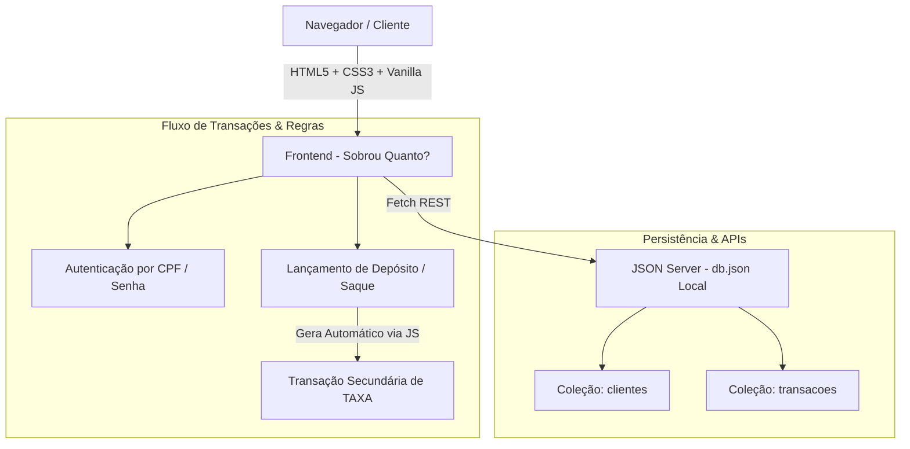
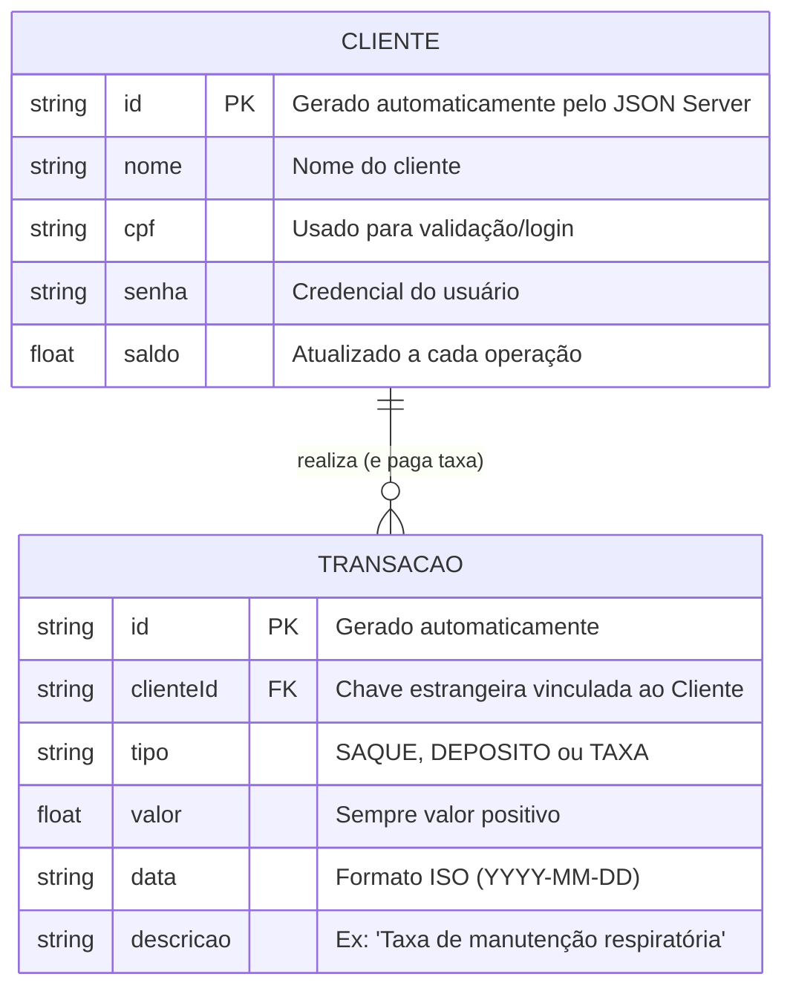

# 🛠️ Arquitetura e Especificação Técnica - Sobrou Quanto?

Este documento descreve a arquitetura técnica, o modelo de dados, a integração com o JSON Server e as regras de negócio para a aplicação **Sobrou Quanto?**, adaptada a partir da especificação do sistema bancário Roubank.

---

## 1. Visão Geral da Arquitetura

A aplicação opera no modelo client-side (Single Page Application ou multi-páginas estáticas) integrada a uma API REST simulada localmente via JSON Server.


## 2. Modelo de Dados (Diagrama ER)
O Diagrama Entidade-Relacionamento (DER) abaixo representa a estrutura de dados persistida no db.json e o relacionamento entre os clientes e suas movimentações financeiras:



## 3. Dicionário de Dados
####Clientes
Armazena as informações dos usuários, credenciais de acesso e saldo atualizado.

* `id`: Identificador único do usuário (String/Hash gerado pelo JSON Server).

* `nome`: Nome completo do cliente.

* `cpf`: Chave de acesso e identificação (validação realizada no front-end).

* `senha`: Senha de autenticação do usuário.

* `saldo`: Valor numérico (`float`) acumulado. Pode ser negativo devido ao débito automático de taxas.

#### Transações
Registra todas as movimentações de entradas, saídas e taxas operacionais.

* `id`: Identificador único da transação.

* `clienteId`: Chave estrangeira que vincula a transação ao cliente correspondente (GET /transacoes?clienteId=:id).

* `tipo`: Tipo da operação, restrito aos valores "SAQUE", "DEPOSITO" ou "TAXA".

* `valor`: Montante numérico positivo da transação.

* `data`: Data do lançamento no formato ISO (YYYY-MM-DD).

* `descricao`: Texto descritivo do lançamento ou justificativa da taxa cobrada.

#### Regra de Negócio Crítica 
Sempre que o usuário efetuar um SAQUE ou DEPOSITO, a aplicação JS deve disparar automaticamente uma segunda transação do tipo TAXA, subtraindo o valor estipulado do saldo do cliente.

##4. Rotas e Endpoints da API (JSON Server)
A aplicação consome a API REST simulada através dos seguintes endpoints:

* `GET /clientes`: Retorna a lista de clientes cadastrados.

* `POST /clientes`: Realiza o cadastro de um novo cliente.

* `GET /transacoes?clienteId=:id`: Retorna o extrato e histórico financeiro de um cliente específico.

* `POST /transacoes`: Registra uma nova transação (DEPOSITO, SAQUE ou TAXA).

* `PATCH /clientes/:id`: Atualiza o saldo consolidado do cliente após as operações.

## 5. Estrutura Inicial do Banco de Dados (`db.json`)
Modelo inicial para carregar e rodar a API fake do projeto:

```JSON
{
  "clientes": [
    {
      "id": "1",
      "nome": "João da Silva",
      "cpf": "12345678900",
      "senha": "senha_super_segura",
      "saldo": 850.50
    }
  ],
  "transacoes": [
    {
      "id": "1",
      "clienteId": "1",
      "tipo": "DEPOSITO",
      "valor": 1000.00,
      "data": "2026-03-16",
      "descricao": "Depósito inicial em espécie"
    },
    {
      "id": "2",
      "clienteId": "1",
      "tipo": "TAXA",
      "valor": 50.00,
      "data": "2026-03-16",
      "descricao": "Taxa de boas-vindas do Roubank"
    },
    {
      "id": "3",
      "clienteId": "1",
      "tipo": "SAQUE",
      "valor": 99.50,
      "data": "2026-03-17",
      "descricao": "Saque no caixa eletrônico"
    }
  ]
}
```
