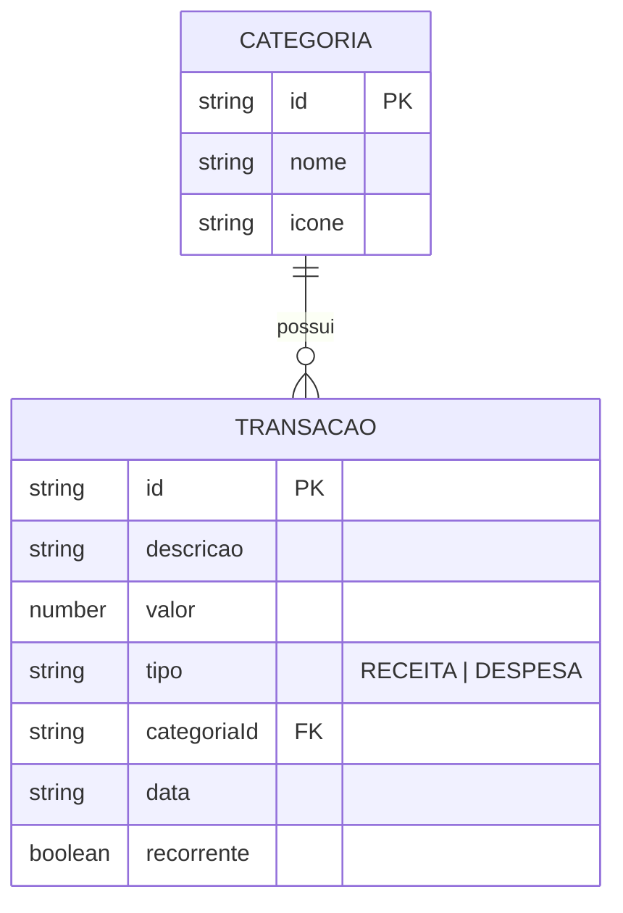

### 📄 Arquivo: `docs/architecture.md`

# 🛠️ Especificação Técnica (Tech Spec) - SobrouQuanto?

Este documento detalha a arquitetura técnica, os frameworks e bibliotecas de interface, o modelo de dados, as rotas e a estrutura da API simulada (JSON Server) necessários para o funcionamento da aplicação **SobrouQuanto?**.

---

## 1. Visão Geral da Arquitetura e Frameworks CSS

A aplicação foi concebida no modelo **Multi-Page Application (MPA)** responsiva e opera inteiramente em nível de cliente no frontend. O ecossistema é composto por 4 páginas HTML distintas (`login.html`, `index.html`, `cadastros.html` e `transacoes.html`), consumindo serviços REST assíncronos e bibliotecas CSS/JS de estilização.

```mermaid
graph TD
    A[Navegador / Cliente] -->|HTML5 + CSS3| B[Frontend - Vanilla JS ES6+]
    
    subgraph Frameworks CSS & Interface
        B --> C[Bootstrap 5 - Grid System & Flexbox]
        B --> D[Materialize CSS - Form Inputs & Modais]
        B --> E[Design Tokens - Variáveis CSS Customizadas]
    end

    subgraph Módulos JS (Client-Side)
        B --> F[Autenticação & Sessão - auth.js]
        B --> G[Renderização do DOM - render.js]
        B --> H[Validações & REGEX - validacao.js]
        B --> I[Cliente HTTP Async/Await - api.js]
    end

    subgraph Persistência & APIs
        I -->|Fetch REST| J[JSON Server - db.json Local]
        I -->|Fetch REST| K[AwesomeAPI - Cotações]
        F -->|Web Storage| L[SessionStorage - Dados do Login]
        H -->|Web Storage| M[LocalStorage - Preferências]
    end

```

---

## 2. Modelo de Dados (Diagrama ER)

Abaixo está o Diagrama Entidade-Relacionamento (DER) que representa a estrutura das coleções no nosso "banco de dados" (`db.json`) e como as informações se conectam.



---

## 3. Dicionário de Dados

Breve explicação das tabelas principais:

* **Categorias:** Armazena os grupos de classificação criados pelo usuário para organizar os orçamentos.
* `id`: Identificador único gerado pelo JSON Server (String ou Hash).
* `nome`: Nome identificador da categoria (ex: Alimentação, Moradia, Salário).
* `icone`: Classe do ícone ou identificador visual associado.


* **Transações:** Registra o histórico financeiro de receitas e despesas.
* `id`: Identificador único da movimentação.
* `categoriaId`: Chave estrangeira que vincula a transação à categoria (padrão de nomenclatura exigido pelo JSON Server para rotas aninhadas).
* `descricao`: Texto explicativo sobre o lançamento.
* `tipo`: Aceita apenas os valores `"RECEITA"` ou `"DESPESA"`.
* `valor`: Valor numérico (Float). O frontend utiliza este campo e o tipo para somar ou subtrair no saldo acumulado.
* `data`: Data do lançamento (formato YYYY-MM-DD).


---

## 4. Rotas da API (JSON Server e APIs Externas)

A aplicação consome a API local simulada pelo JSON Server e a API pública AwesomeAPI. Principais endpoints:

* **GET /categorias** - Retorna a lista de categorias cadastradas.
* **POST /categorias** - Cadastra uma nova categoria no banco local.
* **GET /transacoes** - Retorna a lista completa de lançamentos financeiros.
* **POST /transacoes** - Cadastra uma nova receita ou despesa.
* **DELETE /transacoes/:id** - Remove uma transação específica por ID.
* **GET https://economia.awesomeapi.com.br/last/USD-BRL,EUR-BRL** - Consulta a cotação do Dólar e do Euro em tempo real para exibição no Dashboard.

---

## 5. Estrutura do Banco de Dados (`server/db.json`)

Esta é a representação em formato JSON do banco de dados simulado. Esta estrutura serve de contexto para o JSON Server inicializar a API Fake local:

```json
{
  "categorias": [
    {
      "id": "1",
      "nome": "Alimentação",
      "icone": "utensils"
    },
    {
      "id": "2",
      "nome": "Moradia",
      "icone": "home"
    },
    {
      "id": "3",
      "nome": "Renda / Salário",
      "icone": "wallet"
    }
  ],
  "transacoes": [
    {
      "id": "101",
      "categoriaId": "3",
      "descricao": "Salário Mensal",
      "tipo": "RECEITA",
      "valor": 3500.00,
      "data": "2026-08-01",
      "recorrente": true
    },
    {
      "id": "102",
      "categoriaId": "1",
      "descricao": "Supermercado",
      "tipo": "DESPESA",
      "valor": 280.50,
      "data": "2026-08-20",
      "recorrente": false
    }
  ]
}

```

```

```
