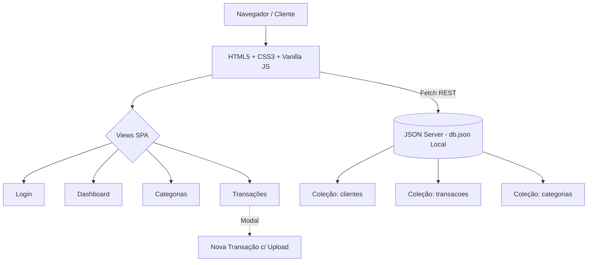
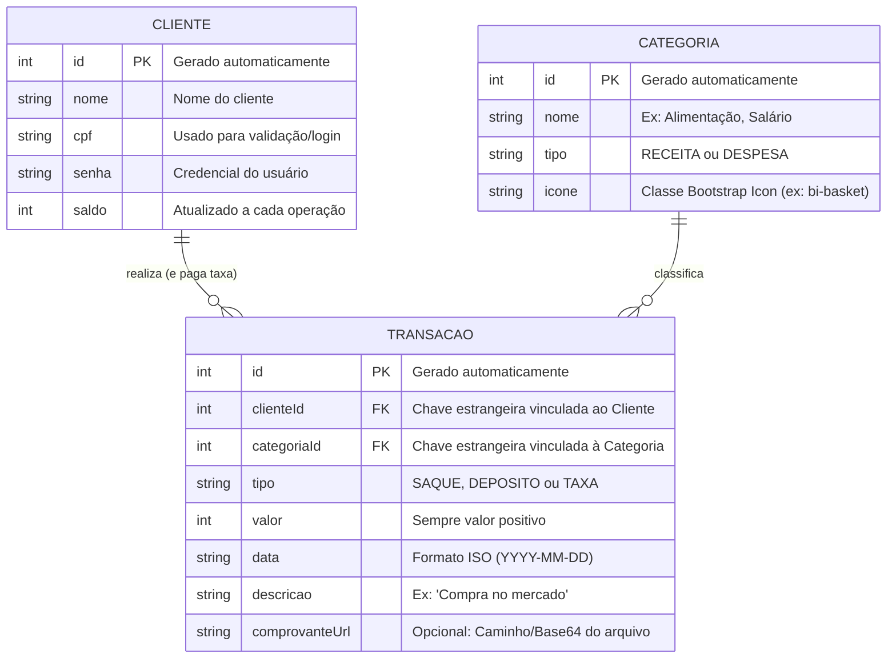

# 🛠️ Arquitetura e Especificação Técnica - Sobrou Quanto?

Este documento descreve a arquitetura técnica, o modelo de dados, a integração com o JSON Server e as regras de negócio para a aplicação **Sobrou Quanto?**, uma plataforma Single Page Application (SPA) para gestão de finanças pessoais.

## 1. Visão Geral da Arquitetura e Telas

A aplicação opera no modelo client-side, sem recarregamento de páginas, integrada a uma API REST simulada localmente via JSON Server. 

O sistema é composto pelas seguintes **Telas (Views)** principais:
1. **Login:** Autenticação do usuário e acesso ao sistema.
2. **Dashboard:** Visão geral financeira, exibindo Saldo Total, cards de Receitas/Despesas, Cotações de Moedas em tempo real e um Gráfico de Fluxo de Caixa gerado dinamicamente com base nas transações.
3. **Categorias:** Gerenciamento (CRUD) de categorias de classificação (ex: Alimentação, Moradia, Salário).
4. **Transações:** Histórico de lançamentos com filtros avançados e o **Modal de Nova Transação** (que permite inserir valor, data, descrição, selecionar a categoria e anexar comprovantes).



## 2. Modelo de Dados (Diagrama ER)

O Diagrama Entidade-Relacionamento (DER) abaixo representa a estrutura de dados persistida no db.json. A entidade CATEGORIA foi adicionada para classificar as transações, facilitando a filtragem e a geração dos gráficos no Dashboard.



## 3. Dicionário de Dados
#### Clientes
Armazena as informações dos usuários, credenciais de acesso e saldo atualizado.

`id`: Identificador único do usuário (String/Hash gerado pelo JSON Server).

`nome`: Nome completo do cliente.

`cpf`: Chave de acesso e identificação.

`senha`: Senha de autenticação do usuário.

`saldo`: Valor numérico acumulado, calculado com base nas transações.

#### Categorias
Permite a personalização da organização financeira.

`id`: Identificador único da categoria.

`nome`: Título da categoria (ex: "Moradia").

`tipo`: Define se a categoria é de entrada (RECEITA) ou saída (DESPESA).

`icone`: Classe de ícone visual para renderização na UI (ex: bi-house).

#### Transações
Registra todas as movimentações financeiras.

`id`: Identificador único da transação.

`clienteId`: Chave estrangeira que vincula a transação ao cliente (GET /transacoes?clienteId=:id).

`categoriaId`: Chave estrangeira que classifica a transação.

`tipo`: Tipo da operação (SAQUE, DEPOSITO ou TAXA).

`valor`: Montante numérico absoluto da transação.

`data`: Data do lançamento no formato ISO (YYYY-MM-DD).

`descricao`: Texto descritivo.

`comprovanteUrl`: URL ou string base64 do arquivo anexado no modal.

## 4. Rotas e Endpoints da API (JSON Server)
A aplicação consome a API REST simulada através dos seguintes endpoints básicos:

`GET /clientes | POST /clientes` : Gestão de usuários.

`PATCH /clientes/:id` : Atualização de saldos e perfil.

`GET /categorias | POST /categorias` : Listagem e criação de categorias cadastradas na tela "Cadastros".

`GET /transacoes?clienteId=:id` : Histórico financeiro para popular a tabela e gerar o gráfico no Dashboard.

`POST /transacoes` : Registro gerado através do Modal de "Nova Transação".

## 5. Estrutura Inicial do Banco de Dados (db.json)
Modelo de estrutura inicial sugerida para subir a API local:

```JSON
{
  "clientes": [
    {
      "id": "1",
      "nome": "Usuário SobrouQuanto",
      "cpf": "12345678900",
      "senha": "senha_super_segura",
      "saldo": 14350.00
    }
  ],
  "categorias": [
    {
      "id": "1",
      "nome": "Alimentação",
      "tipo": "DESPESA",
      "icone": "bi-basket"
    },
    {
      "id": "2",
      "nome": "Salário",
      "tipo": "RECEITA",
      "icone": "bi-cash-coin"
    }
  ],
  "transacoes": [
    {
      "id": "1",
      "clienteId": "1",
      "categoriaId": "2",
      "tipo": "DEPOSITO",
      "valor": 18500.00,
      "data": "2026-08-24",
      "descricao": "Salário Mensal",
      "comprovanteUrl": ""
    },
    {
      "id": "2",
      "clienteId": "1",
      "categoriaId": "1",
      "tipo": "SAQUE",
      "valor": 450.00,
      "data": "2026-08-26",
      "descricao": "Mercado Central",
      "comprovanteUrl": "data:image/png;base64,iVBORw0KG..."
    }
  ]
}
```
