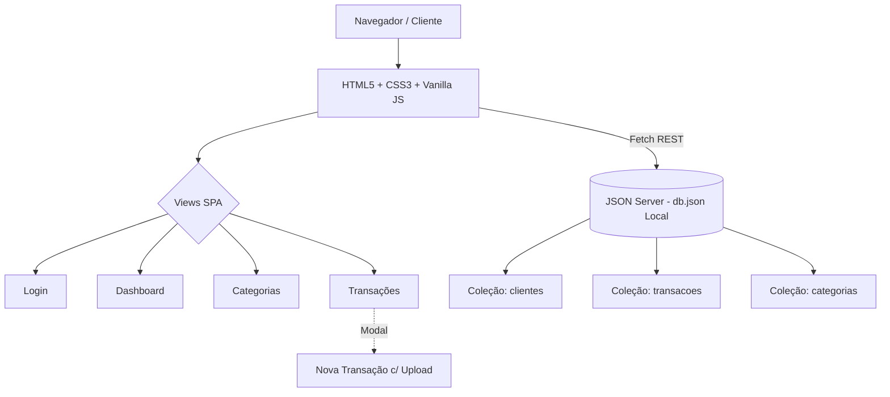
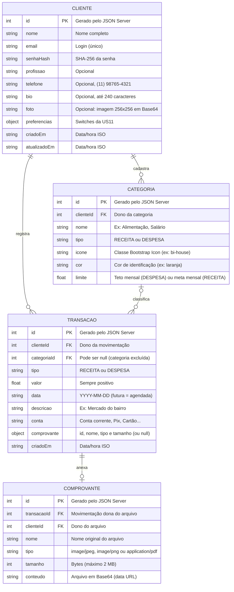

# 🛠️ Arquitetura e Especificação Técnica - Sobrou Quanto?

Este documento descreve a arquitetura técnica, o modelo de dados, a integração com o JSON Server e as regras de negócio para a aplicação **Sobrou Quanto?**, uma plataforma Single Page Application (SPA) para gestão de finanças pessoais.

## 1. Visão Geral da Arquitetura e Telas

A aplicação opera no modelo client-side, sem recarregamento de páginas, integrada a uma API REST simulada localmente via JSON Server. 

O sistema é composto pelas seguintes **Telas (Views)** principais:
1. **Login:** Autenticação do usuário e acesso ao sistema.
2. **Dashboard:** Visão geral financeira, exibindo Saldo Total, cards de Receitas/Despesas, Cotações de Moedas em tempo real e um Gráfico de Fluxo de Caixa gerado dinamicamente com base nas transações.
3. **Categorias:** Gerenciamento (CRUD) de categorias de classificação (ex: Alimentação, Moradia, Salário).
4. **Transações:** Histórico de lançamentos com filtros avançados e o **Modal de Nova Transação** (que permite inserir valor, data, descrição, selecionar a categoria e anexar comprovantes).


```mermaid
graph TD
    A[Navegador / Cliente] --> B[HTML5 + CSS3 + Vanilla JS]
    B --> C{Views SPA}
    C --> D[Login]
    C --> E[Dashboard]
    C --> F[Categorias]
    C --> G[Transações]
    G -.->|Modal| H[Nova Transação c/ Upload]
    
    B -->|Fetch REST| I[(JSON Server - db.json Local)]
    I --> J[Coleção: clientes]
    I --> K[Coleção: transacoes]
    I --> L[Coleção: categorias]
```
### 1.1. Tecnologias e Dependências

* **Framework CSS:** [Bootstrap](https://getbootstrap.com/) (`v5.3.8`)
  * **Uso:** Sistema de grid responsivo (Flexbox) e componentes prontos (Navbar, Cards, Modais, Forms, Dropdowns) via classes utilitárias e o bundle JS próprio (inclui Popper para tooltips/dropdowns). Não depende de jQuery.
  * **Inclusão:**
    * CSS: `css/bootstrap.css`, compilado pelo Sass a partir de `node_modules/bootstrap/scss` com as cores e fontes do Design System (ver Sass abaixo).
    * JS: `node_modules/bootstrap/dist/js/bootstrap.bundle.min.js` (NPM)

* **Ícones:** [Bootstrap Icons](https://icons.getbootstrap.com/) (`v1.13.1`)
  * **Uso:** Biblioteca oficial de ícones do Bootstrap. Usada no campo `icone` da entidade Categoria (ex: `bi-basket`, `bi-cash-coin`, `bi-house`) e nos demais ícones de interface.
  * **Inclusão (via NPM):** `node_modules/bootstrap-icons/font/bootstrap-icons.min.css`

* **Fontes:** [Plus Jakarta Sans](https://fontsource.org/fonts/plus-jakarta-sans) e [JetBrains Mono](https://fontsource.org/fonts/jetbrains-mono) via `@fontsource` (NPM)
  * **Uso:** Plus Jakarta Sans na interface e JetBrains Mono nos valores monetários e cotações (algarismos tabulares), conforme o Design System.
  * **Inclusão (via NPM):** `node_modules/@fontsource/plus-jakarta-sans/{400..700}.css` e `node_modules/@fontsource/jetbrains-mono/{400..700}.css`

* **Pré-processador CSS:** [Sass](https://sass-lang.com/) (`v1.105`, dependência de desenvolvimento)
  * **Uso:** Os Design Tokens (cores, tipografia, espaçamentos, raios e sombras) ficam em `scss/_variaveis.scss`. O arquivo `scss/bootstrap.scss` sobrescreve as variáveis do Bootstrap (`$primary`, `$danger`, `$font-family-sans-serif` etc.) antes de compilá-lo, e `scss/style.scss` reúne os estilos próprios da aplicação, organizados em parciais por tela.
  * **Compilação:** `npm run sass` (modo watch) ou `npm run sass:build` (minificado), gerando `css/bootstrap.css` e `css/style.css`, que são os arquivos carregados pelo HTML.

* **API Pública de Cotações:** [AwesomeAPI](https://docs.awesomeapi.com.br/api-de-moedas) (`v1`)
  * **Uso:** Consumo de cotações de moedas em tempo real para exibição no Dashboard.
  * **Endpoint:** `GET https://economia.awesomeapi.com.br/json/last/USD-BRL,EUR-BRL,BTC-BRL`

## 2. Modelo de Dados (Diagrama ER)

O Diagrama Entidade-Relacionamento (DER) abaixo representa a estrutura de dados persistida no `server/db.json`. Cada cliente enxerga apenas as próprias categorias e movimentações (filtro por `clienteId`). Nenhum valor exibido na interface é fixo no HTML: saldo, totais, percentuais, gráfico e notificações são calculados pelo JavaScript a partir destes registros.


```mermaid
erDiagram
    CLIENTE ||--o{ CATEGORIA : "cadastra"
    CLIENTE ||--o{ TRANSACAO : "registra"
    CATEGORIA |o--o{ TRANSACAO : "classifica"
    TRANSACAO ||--o| COMPROVANTE : "anexa"

    CLIENTE {
        int id PK "Gerado pelo JSON Server"
        string nome "Nome completo"
        string email "Login (único)"
        string senhaHash "SHA-256 da senha"
        string profissao "Opcional"
        string telefone "Opcional, (11) 98765-4321"
        string bio "Opcional, até 240 caracteres"
        string foto "Opcional: imagem 256x256 em Base64"
        object preferencias "Switches da US11"
        string criadoEm "Data/hora ISO"
        string atualizadoEm "Data/hora ISO"
    }

    CATEGORIA {
        int id PK "Gerado pelo JSON Server"
        int clienteId FK "Dono da categoria"
        string nome "Ex: Alimentação, Salário"
        string tipo "RECEITA ou DESPESA"
        string icone "Classe Bootstrap Icon (ex: bi-house)"
        string cor "Cor de identificação (ex: laranja)"
        float limite "Teto mensal (DESPESA) ou meta mensal (RECEITA)"
    }

    TRANSACAO {
        int id PK "Gerado pelo JSON Server"
        int clienteId FK "Dono da movimentação"
        int categoriaId FK "Pode ser null (categoria excluída)"
        string tipo "RECEITA ou DESPESA"
        float valor "Sempre positivo"
        string data "YYYY-MM-DD (futura = agendada)"
        string descricao "Ex: Mercado do bairro"
        string conta "Conta corrente, Pix, Cartão..."
        object comprovante "id, nome, tipo e tamanho (ou null)"
        string criadoEm "Data/hora ISO"
    }

    COMPROVANTE {
        int id PK "Gerado pelo JSON Server"
        int transacaoId FK "Movimentação dona do arquivo"
        int clienteId FK "Dono do arquivo"
        string nome "Nome original do arquivo"
        string tipo "image/jpeg, image/png ou application/pdf"
        int tamanho "Bytes (máximo 2 MB)"
        string conteudo "Arquivo em Base64 (data URL)"
    }
```

## 3. Dicionário de Dados
#### Clientes
Criados pela tela de cadastro (login.html → "Cadastre-se").

`id`: Identificador numérico gerado pelo JSON Server.

`nome`: Nome completo (validado por regex: nome e sobrenome).

`email`: E-mail de acesso, gravado em minúsculas e único no sistema.

`senhaHash`: Hash SHA-256 da senha (Web Crypto API). A senha em texto puro nunca é gravada.

`profissao`, `telefone`, `bio`: Dados do perfil (US10), editáveis em perfil.html.

`foto`: Foto de perfil reduzida para 256x256 em um `<canvas>` e salva em Base64. Sem foto, a interface mostra as iniciais do nome.

`preferencias`: `{ alertas, modoEscuro, cotacoesAuto, lembreteComprovante }` (US11).

`criadoEm` / `atualizadoEm`: Datas usadas em "Membro desde" e "Última alteração".

> O saldo **não** é gravado: ele é sempre calculado (Receitas − Despesas) a partir das transações, para nunca ficar desatualizado.

#### Categorias
`clienteId`: Cliente dono da categoria.

`nome`: Título da categoria (não pode repetir para o mesmo tipo).

`tipo`: Entrada (RECEITA) ou saída (DESPESA).

`icone`: Classe do Bootstrap Icons (ex: bi-house).

`cor`: Cor da paleta (laranja, vermelho, verde, azul, roxo, ambar, rosa ou ciano).

`limite`: Para DESPESA é o teto de gastos do mês; para RECEITA é a meta de recebimento. A barra de progresso mostra (movimentado no mês ÷ limite).

#### Transações
`clienteId` / `categoriaId`: Chaves estrangeiras. Ao excluir uma categoria, as transações dela recebem `categoriaId: null` antes do DELETE, porque o JSON Server apaga em cascata os registros que apontam para o id excluído.

`tipo`: RECEITA ou DESPESA (sempre igual ao tipo da categoria).

`valor`: Valor absoluto; o sinal é definido pelo tipo.

`data`: Data no formato ISO. Despesas com data futura aparecem como "Agendada" e geram o alerta de vencimento.

`conta`: Forma de pagamento escolhida no modal.

`comprovante`: Resumo do arquivo anexado (`id`, `nome`, `tipo`, `tamanho`) ou `null`. O arquivo em si fica na coleção `comprovantes`, para a listagem de transações continuar leve.

#### Comprovantes
`transacaoId`: Transação dona do arquivo. Ao excluir a transação, o JSON Server apaga o comprovante junto (cascata).

`conteudo`: Arquivo em Base64 (data URL), lido com `FileReader`.

## 4. Rotas e Endpoints da API (JSON Server)
A API roda com `npm run api` em `http://localhost:3000`:

| Método | Rota | Uso |
|---|---|---|
| GET | `/clientes?email=:email` | Login e verificação de e-mail já cadastrado |
| POST | `/clientes` | Cadastro de conta |
| GET / PATCH | `/clientes/:id` | Carregar e editar perfil, foto, senha e preferências |
| GET | `/categorias?clienteId=:id` | Categorias do cliente |
| POST / PATCH / DELETE | `/categorias` · `/categorias/:id` | Cadastro, edição e exclusão de categorias |
| GET | `/transacoes?clienteId=:id` | Extrato, dashboard e notificações |
| POST / PATCH / DELETE | `/transacoes` · `/transacoes/:id` | Nova movimentação, edição, importação CSV e exclusão |
| GET / POST / DELETE | `/comprovantes/:id` · `/comprovantes` | Abrir, anexar e trocar comprovantes |

API pública: `GET https://economia.awesomeapi.com.br/json/last/USD-BRL,EUR-BRL,GBP-BRL` (cotações, com cache de 1 minuto no sessionStorage e tempo limite de 8 segundos).

## 5. Estrutura Inicial do Banco de Dados (db.json)
O banco começa **vazio**. Tudo o que aparece na aplicação é cadastrado pelas telas:

```JSON
{
  "clientes": [],
  "categorias": [],
  "transacoes": [],
  "comprovantes": []
}
```

## 6. Organização do JavaScript
Os scripts são **ES Modules** (`<script type="module">`), por isso a aplicação precisa ser aberta por um servidor (JSON Server ou Live Server), e não com duplo clique no arquivo.

| Arquivo | Responsabilidade |
|---|---|
| `js/api.js` | `fetch` com `async/await` para o JSON Server e a AwesomeAPI, com tratamento de erros |
| `js/main.js` | Sessão (sessionStorage/localStorage), proteção das páginas, navbar, modo escuro, hash da senha |
| `js/validacao.js` | Expressões regulares, máscaras de valor e telefone, mensagens de erro nos campos |
| `js/calculos.js` | Regras de negócio: saldo, totais do mês, uso do limite das categorias |
| `js/render.js` | Formatação (moeda, datas) e trechos de HTML reaproveitados |
| `js/notificacoes.js` | Notificações do sininho geradas a partir dos dados |
| `js/comprovante.js` | Upload do comprovante (tipo, tamanho, arrastar e soltar) |
| `js/paginas/*.js` | Código específico de cada tela |
